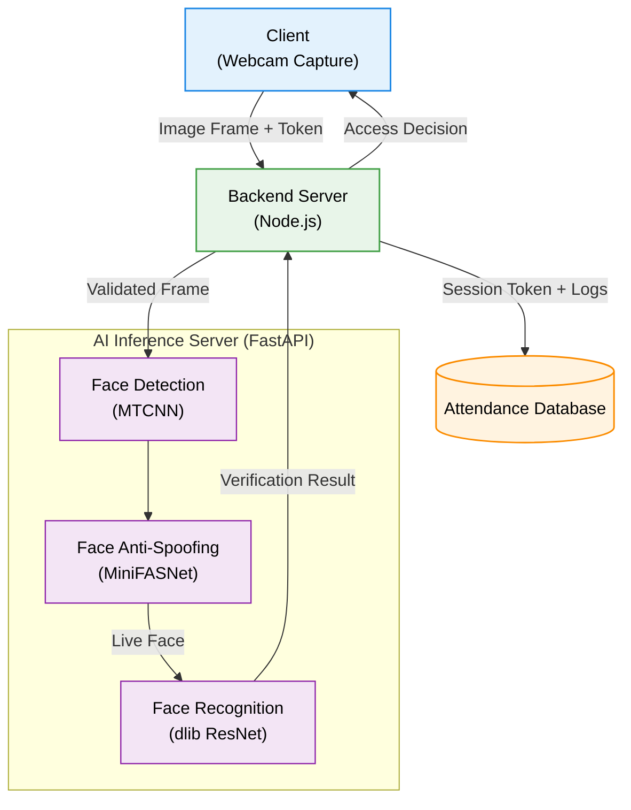

```mermaid
flowchart TB
    %% Nodes
    Client["Client\n(Webcam Capture)"]
    Backend["Backend Server\n(Node.js)"]
    DB[(Attendance Database)]

    %% AI Engine
    subgraph AI["AI Inference Server (FastAPI)"]
        FD["Face Detection\n(MTCNN)"]
        FAS["Face Anti-Spoofing\n(MiniFASNet)"]
        FR["Face Recognition\n(dlib ResNet)"]
    end

    %% Flow
    Client -->|Image Frame + Token| Backend
    Backend -->|Validated Frame| FD
    FD --> FAS
    FAS -->|Live Face| FR
    FR -->|Verification Result| Backend
    Backend -->|Session Token + Logs| DB
    Backend -->|Access Decision| Client

    %% Styling (ALL TEXT BLACK)
    style Client fill:#E3F2FD,stroke:#1E88E5,stroke-width:1.5px,color:#000000
    style Backend fill:#E8F5E9,stroke:#43A047,stroke-width:1.5px,color:#000000
    style DB fill:#FFF3E0,stroke:#FB8C00,stroke-width:1.5px,color:#000000

    style FD fill:#F3E5F5,stroke:#8E24AA,stroke-width:1.2px,color:#000000
    style FAS fill:#F3E5F5,stroke:#8E24AA,stroke-width:1.2px,color:#000000
    style FR fill:#F3E5F5,stroke:#8E24AA,stroke-width:1.2px,color:#000000


```